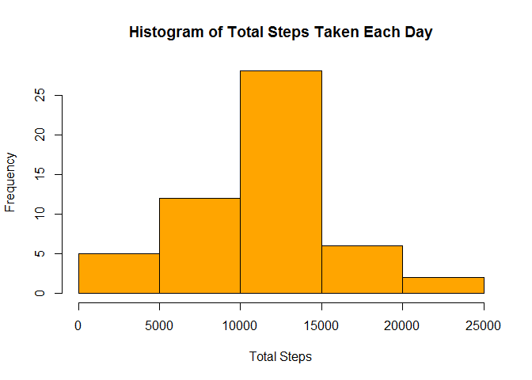
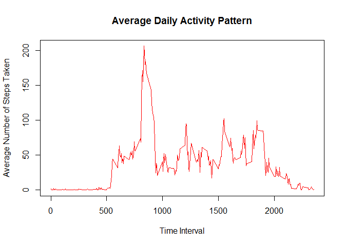
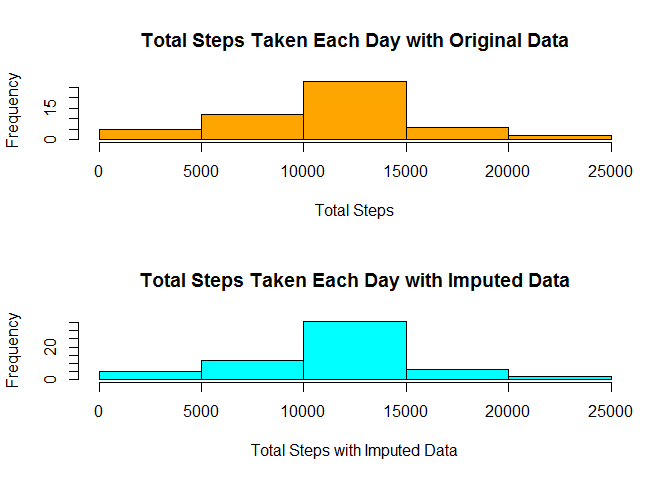
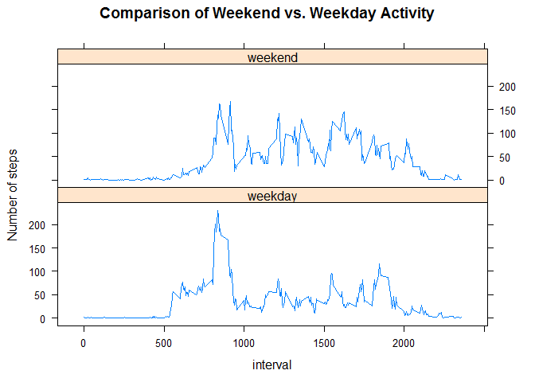

# Reproducible Research: Peer Assessment 1


## Loading and preprocessing the data
-------------------------------------------------------

Load activity.csv and convert dates to the R date class


```r
df.activity <- read.csv('activity.csv')
df.activity$date <- as.Date(df.activity$date
                            ,'%Y-%m-%d'
                            )
```


## What is mean total number of steps taken per day?

1. Calculate the total number of steps taken per day:


```r
totalSteps <- tapply(df.activity$steps
                     ,df.activity$date
                     ,sum
                     )
```
  
  
  
2. Histogram of steps taken each day


```r
hist(totalSteps
     ,col ='orange'
     ,xlab = "Total Steps"
     ,main = "Histogram of Total Steps Taken Each Day"
     )
```

 

3. Calculate and report the mean and median of the total number of steps taken per day

Calculate Mean and round to 2 decimal places:

```r
meanSPD <- format(round(mean(totalSteps
                             ,na.rm=TRUE
                             ), 2)
                  ,nsmall = 2
                  )
meanSPD
```

```
## [1] "10766.19"
```

Calculate Median:

```r
medianSPD <- median(totalSteps
       ,na.rm=TRUE
       )
medianSPD
```

```
## [1] 10765
```

The mean and median of steps taken per day are **10766.19** and **10765** respectively.

## What is the average daily activity pattern?

1. Make a time series plot of the 5-minute interval and the average steps taken, averaged across all days

To create this plot, first calculate the average for each 5 minute interval across all days:


```r
meanSteps <- tapply(df.activity$steps
                    ,df.activity$interval
                    ,mean
                    ,na.rm = TRUE
                    )
```

Create the time series plot of intervals (x-axis) and average steps taken (y-axis):


```r
plot(row.names(meanSteps)
     ,meanSteps
     ,col='red'
     ,type ='l'
     ,xlab = "Time Interval"
     ,ylab = "Average Number of Steps Taken"
     ,main = "Average Daily Activity Pattern"
     )
```

 

2. Determine which 5-minute interval on average across all days contains the maximum number of steps:
  
  

```r
maxInterval <- names(which.max(meanSteps))
maxInterval
```

```
## [1] "835"
```

The interval lableled: **835**, contains the largest number of steps across all days.  

## Imputing missing values

Note that there are a number of days/intervals where there are missing values.  The presence of missing days may introduce bias into some calculations or summaries of data.

1. Calculate the total number of missing values:


```r
missingVals <- df.activity[is.na(df.activity$steps),]
length(missingVals$steps)
```

```
## [1] 2304
```

The total number of missing values in the dataset is **2304**. 

2. The strategy  to fill-in the missing interval data will be to replace missing values with the mean for the interval across all days.

3. Create a new dataset that is equal to the original but has the missing values filled in:  

First, make a copy of the original data and verify that it is correct:


```r
df.imputed <- df.activity
summary(df.activity)
```

```
##      steps             date               interval     
##  Min.   :  0.00   Min.   :2012-10-01   Min.   :   0.0  
##  1st Qu.:  0.00   1st Qu.:2012-10-16   1st Qu.: 588.8  
##  Median :  0.00   Median :2012-10-31   Median :1177.5  
##  Mean   : 37.38   Mean   :2012-10-31   Mean   :1177.5  
##  3rd Qu.: 12.00   3rd Qu.:2012-11-15   3rd Qu.:1766.2  
##  Max.   :806.00   Max.   :2012-11-30   Max.   :2355.0  
##  NA's   :2304
```

```r
summary(df.imputed)
```

```
##      steps             date               interval     
##  Min.   :  0.00   Min.   :2012-10-01   Min.   :   0.0  
##  1st Qu.:  0.00   1st Qu.:2012-10-16   1st Qu.: 588.8  
##  Median :  0.00   Median :2012-10-31   Median :1177.5  
##  Mean   : 37.38   Mean   :2012-10-31   Mean   :1177.5  
##  3rd Qu.: 12.00   3rd Qu.:2012-11-15   3rd Qu.:1766.2  
##  Max.   :806.00   Max.   :2012-11-30   Max.   :2355.0  
##  NA's   :2304
```

Next, impute the copy dataset by filling-in the missing values with the mean of steps for the interval across all days:  


```r
df.imputed$steps[is.na(df.imputed$steps)] <- tapply(df.imputed$steps
                                                    ,df.imputed$interval
                                                    ,mean
                                                    ,na.rm = TRUE)
```

Verify that the new imputed dataset no longer has any missing values by comparing it to the original:  


```r
missingValsImp <- df.imputed[is.na(df.imputed$steps),]
length(missingValsImp$steps)
```

```
## [1] 0
```

4. Compare the mean and median of steps taken each day before and after imputing the missing data:

*(Recall that the mean and median for the original data was created previously and stored in svaraiale: meanSPD and medianSPD)*  

Calculate the mean and median for the imputed dataset:

```r
totalSteps.imp <- tapply(df.imputed$steps
                     ,df.imputed$date
                     ,sum
                     )
meanSPD.imp <- format(round(mean(totalSteps.imp
                             ,na.rm=TRUE
                             ), 2)
                  ,nsmall = 2
                  )
medianSPD.imp <- median(totalSteps.imp
       ,na.rm=TRUE
       )
```

The averages for the original data set and the Imputed datasets are:


```r
meanSPD
```

```
## [1] "10766.19"
```

```r
meanSPD.imp
```

```
## [1] "10766.19"
```

The median for the original data set and imputed datasets are:

```r
medianSPD
```

```
## [1] 10765
```

```r
medianSPD.imp
```

```
## [1] 10766.19
```

Comparison histograms of Total Steps Taken Each Day before and after imputing missing data:

```r
par(mfrow = c(2,1))
hist(totalSteps
     ,col ='orange'
     ,xlab = "Total Steps"
     ,main = "Total Steps Taken Each Day with Original Data"
     )
hist(totalSteps.imp
     ,col ='cyan'
     ,xlab = "Total Steps with Imputed Data"
     ,main = "Total Steps Taken Each Day with Imputed Data"
     )
```

 

As a summary, it appears that imputing the missing interval data does not significantly change the mean or median of the results; and, as expected it does increase the total number of steps (as shown in the histograms)


## Are there differences in activity patterns between weekdays and weekends?

1.Create a new factor variable in the dataset with two levels indicating whether a given day is a weekday or a weekend.

To create the factor variable, a function is needed to determine the type of day:


```r
fDayType <- function(date) {
        if (weekdays(date) %in% c('Saturday', 'Sunday'))
                return('weekend')
        else
                return('weekday')
}
```

Create the factor variable and calculate the average steps by interval across weekend days and weekdays:


```r
dayType <- sapply(df.imputed$date,fDayType)
df.imputed$dayType <- as.factor(dayType)

meanSPwkdays <- aggregate(df.imputed$steps
                          ,by = list(df.imputed$interval
                                     ,df.imputed$dayType)
                          ,mean)
```

Plot in 2 panels the average steps taken on weedays and weekends


```r
library(lattice)
names(meanSPwkdays) <- c('interval', 'dayType', 'steps')
xyplot(steps~interval | dayType
       ,meanSPwkdays
       ,type = 'l'
       ,ylab = 'Number of steps'
       ,layout = c(1,2)
       ,main = 'Comparison of Weekend vs. Weekday Activity')
```

 

